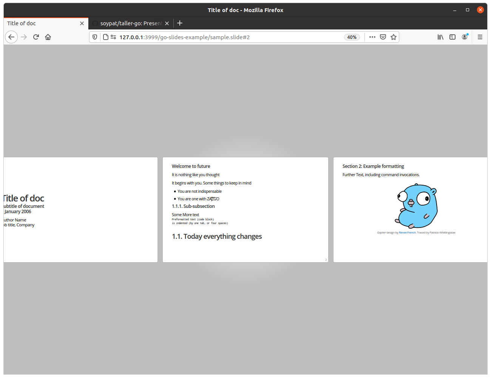

# Taller de go

## `present` protips
[Full documentation can be found here](https://godoc.org/golang.org/x/tools/present)

First two blocks are structure information on

1. The presentation and metadata
    - **Important**: first line defines if markdown or legacy formatting is used. If first character is `#`, markdown is used. These protips are for **markdown!**
2. Authors and contact information

Slide formatting
* `## theTitle` initializes a new slide with `theTitle` header
* Content goes under the double hash tag. i.e.
* `": "` starts an orator note. By running `present -notes` one has access to these notes in a fancy popup window by pressing `n`
```
## A new slide
Been working on slides. Here's a bullet point list:
- Point 1
  - indented point
- more points
: these are orator notes and are collected
// this is a comment and is 100% ignored
### This is a subsection.
#### This is a sub-subsection
    tab indented text is preformatted (4 spaces works too)
```
* one can also use built-in commands for images, code, videos by starting a line with a period followed by the command.

```
## command slide
// following code shows image with 200 pixel width and maintaining aspect ratio.
.image https://golang.org/lib/godoc/images/go-logo-blue.svg 200 _
```

## How to install `present`
Requires:
* [Go](https://golang.org)

On windows
```
go get golang.org/x/tools/cmd/present
cd %GOPATH%/src/golang.org/x/tools/cmd/present
go install
```

On linux/mac
```
go get golang.org/x/tools/cmd/present
cd ${GOPATH}/src/golang.org/x/tools/cmd/present
go install
```
## How to run presentation
Change directory to this repo and run in command:
```
present
```

open browser to [http://127.0.0.1:3999](http://127.0.0.1:3999) to browse slides. 

Should look something like this:
